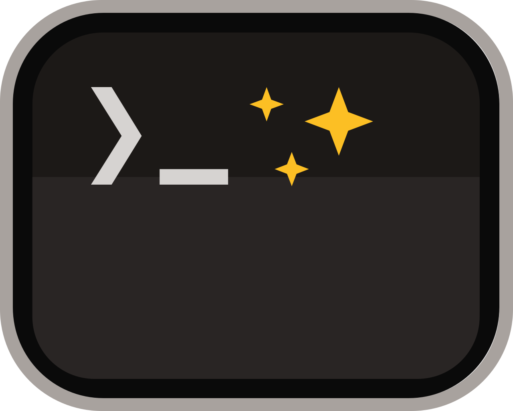

= Awesome Command Line

== 21 Commands To Get You Started With Your Computer's Magic Portal!

This book is a reminder that you have superpowers at your fingertips! We are all familiar with the ways that we interact with our computers on a daily basis — _click, drag, drop, scroll, touch, tap_. The graphical nature of our screens and applications are absolutely amazing and indispensible. In this book, we explore the secret little gems available on all operating systems with another familiar way to interact — _type_! And the best part is that the magical commands we explore are largely derived from the English words that describe them, so acquainting ourselves with these commands is straight-forward with a bit of guidance. Once you become familiar with this small set of essential commands, adding new commands to your toolbox is even easier. With some simple dedication and practice, you will be able to enhance your computing workflow to be even more efficient and powerful. You’ll manage your projects in ways that would otherwise be labor intensive when using your mouse. The intention of this book is to empower you in your creative journey by showing you how the command line is an awesome tool to get things done!

== Contributing

This guide book is a work and progress, and we welcome feedback on the writing, content, examples, diagrams, etc.  To contribute to the project, please create an Issue in the repository, and just describe your proposed changes.  It's helpful to hear about how effective the writing is from a beginner's perspective, and if anything is confusing, unclear, perhaps written a bit too technically.  All perspectives are welcome! Thank you for contributing.

== Book Chapters

The current link:https://raw.githubusercontent.com/christopher-s-jones/awesome-command-line/main/book-draft-copy.pdf?raw=true[Draft Book PDF] is available.

This book source code is written in AsciiDoc, and the text of the book is available in the `+src/pages/+` folder.
It is organized as follows:

. Colophon
. Preface
. Acknowledgements 
. The Command Line Is For Everyone
*  Getting Started
* Terminal Applications
* The Shell
* The Command Prompt
* The Parts of a Command
* Single Line and Multi-Lined Commands
* Command Line Interfaces are Awesome!
. Core Commands: pwd, man, clear, cd, ls
* For the Love of Files and Folders
* The pwd Command--Print the Working Directory
*  File and Directory Paths
* The man Command--Accessing the Manual
* The clear Command--Keeping It Tidy
* The cd Command--Changing Directories
*  Tab Completion--Give Your Fingers A Rest
* The ls Command--Listing Files and Folders
* Core Commands Are Awesome!
. File Commands: echo, mv, cp, rm, nano
* Powerful Ways To Work With Files
* The echo Command--Easily Creating Files
*  Redirection, Standard Input, Output, and Error
* The mv Command--Renaming and Relocating Files
* The cp Command--Copying Files
* The rm Command--Deleting Files
* The nano Command--Creating and Editing Files
* Command Line File Handling is Awesome!
. Folder Commands: mkdir, rmdir, du
* Lightning Fast Folder Management
* The mkdir Command--Creating Directories
* Expansion--Powerful Techniques To Speed Up Your Commands
* The rmdir Command--Deleting Directories
* The du Command--Viewing Disk Usage
* Command Line Folder Handling is Awesome!
. Text Data Commands: cat, sort, head, tail, grep
* Versatile Ways To Work With Text Data
* The cat Command--Viewing and Combining Files
*  Pipes--The Power Of Compound Commands
* The sort Command--Sorting the Contents of a File
* The head Command--Previewing the Top of a File
* The tail Command--Previewing the Bottom of a File
* The grep Command--Filtering Data
* Command Line Data Handling is Awesome!
. Utility Commands: less, history, open
* Utilities That Make Your Life Easier
* The less Command--Paging Output for Easy Viewing
* The history Command--Using Your Command History
* The open Command--Opening Files and Folders
* Command Line Utilities are Awesome!
. Next Steps
* Practice Makes Perfect!
* Upgrade Your Terminal Colors and Prompt
* Explore the Universe of Commands
* Congratulations!
* You Are Awesome!
. Appendix A: Customizing Your Terminal
. Appendix B: Regular Expressions--Matching Patterns Like a Pro
. Appendix C: Using a Package Manager
* Installing More Commands On Your Computer
* For Mac--Installing Homebrew
* For Windows and Linux--Using The Built-In Package Manager

== Generating the book

The book is a work in progress, in DRAFT form, with currently five out of seven chapters written.  To view a copy of the generated PDF, use the following command from within the `+src/+` directory:

[source, console]
----
$ asciidoctor-pdf -v -r ./ruby/extended-pdf-converter.rb -o book.pdf book.adoc
----
